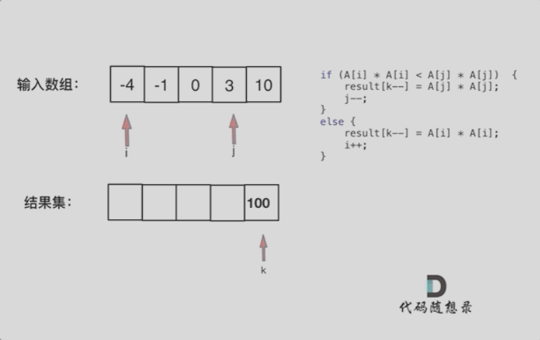
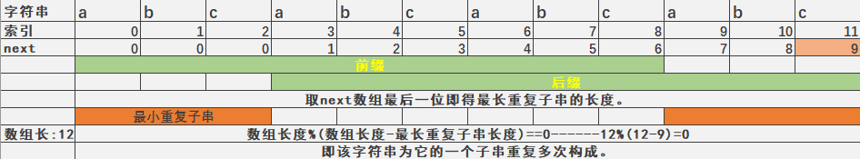

# Code

## 数组总结

#### 二分法
[704.二分查找](https://leetcode.cn/problems/binary-search/submissions/468919507/)
思路：
注意左右区间的定义，此处左右均为闭区间。通过Middle中间值与Target作判断，Middle>target表示target在左区间内，调整左区间，相反调整右区间。相等则直接返回该值的下标。循环的终止条件为right>left，即while(left<=right)。

#### 快慢指针
[27.移除元素](https://leetcode.cn/problems/remove-element/submissions/469195500/)
思路：
注：数组的元素在内存地址中是连续的，不能单独删除，只能覆盖。
定义两个指针。
- 快指针：寻找新数组的元素 ，新数组就是不含有目标元素的数组
- 慢指针：指向更新 新数组下标的位置

操作的是同一个数组，可以理解为慢指针指向一个虚空数组。
条件：当快指针指向的元素不是目标值时，更新新的数组(使用慢指针)。
否则，当遇到目标值时，不更新，慢指针滞后。
最后，返回慢指针即为新数组的数组长度。

[876.链表的中间结点](https://leetcode.cn/problems/middle-of-the-linked-list/description/)
思路：
定义快慢指针都指向头节点，当fast指针不为null,fast.next也不为null时。更新slow = slow.next，fast = fast.next.next。保持快慢指针的差值始终为一半，当fast指向最后时，slow也指向到了中间节点。


#### 双指针法
[977.有序数组的平方](https://leetcode.cn/problems/squares-of-a-sorted-array/description/)

思路：
最左右两边数平方后，必定有一最大数。定义i=0和j=array.Length，表示数组两边，比较它们的平方值。将大值放在新数组的末尾，新数组的索引k为数组长度-1。例如j索引值平方更大，j--。放入一值后，k--。反之i--。左右两边依次比较完后，返回新数组。

#### 滑动窗口
[209.长度最下的子数组](https://leetcode.cn/problems/minimum-size-subarray-sum/)
**含义：** 不断的调节子序列的起始位置和终止位置。
思路：
左右指针初始都指向起始位置，首先移动右指针，累加该区间的值sum，当sum大于目标值时，记录此时区间长度并记录result，并移动左指针，sum要减去左指针的值并++。当sum值小于目标值继续移动右指针。直到右指针走完，根据result记录的值返回。则可以判断最短的子序列长度。

#### 螺旋矩阵II
[59.螺旋矩阵II](https://leetcode.cn/problems/spiral-matrix-ii/description/)
思路：
界定上下左右四条边界值，循环填充值。注意改变内圈的变量初值。


## 链表总结
链表的理论知识。虚拟头节点的使用等。

#### 设计链表
链表的理论巩固，边界值判断。

#### 双指针法
[206.反转链表](https://leetcode.cn/problems/reverse-linked-list/description/)
思路：
两个指针，pre指向null,cur指向头节点，cur指向pre后，cur和pre都前进一位，直到cur为null。

[链表相交](https://leetcode.cn/problems/intersection-of-two-linked-lists-lcci/description/)
思路：
计算两个链表长度，将长的链表的指针和短的链表对齐后，开始比较节点是否相同，然后返回。

#### 快慢指针：
[19.删除链表的倒数第N个节点](https://leetcode.cn/problems/remove-nth-node-from-end-of-list/description/)
思路：
如果要删除倒数第n个节点，让fast移动n步，然后让fast和slow同时移动，直到fast指向链表末尾。删掉slow所指向的节点就可以了。

[142.环形链表Ⅱ](https://leetcode.cn/problems/linked-list-cycle-ii/)
思路：
快慢指针：slow走一步，fast走两步。当他们相遇时则代表链表有环。此节点为**相遇结点**。
如何找到该环的入环的第一个节点？
从**头结点**和**相遇结点**出发，各走一步，直到相遇，再次相遇点即为环的入口节点。

*详细：*[随想录：142.环形链表](https://programmercarl.com/0142.%E7%8E%AF%E5%BD%A2%E9%93%BE%E8%A1%A8II.html#%E7%AE%97%E6%B3%95%E5%85%AC%E5%BC%80%E8%AF%BE)


## 哈希表
**C#中提供的：**
- ***Dictionary<TKey, TValue>:***
Dictionary<TKey, TValue> 是.NET中最常用的哈希表实现，它提供了基于键和值的存储和检索。该数据结构使用哈希算法将键转换为唯一的哈希代码，并使用该代码来快速查找和访问值。在C#中，Dictionary<TKey, TValue> 实现了 IDictionary<TKey, TValue> 接口，可以用于键值对的存储。

- ***Hashtable:***
Hashtable 是.NET中早期的哈希表实现，它使用键值对的形式来存储和检索数据。它与 Dictionary<TKey, TValue> 类似，但不支持泛型，可以存储**任意类型**的键和值。在C#中，Hashtable 类实现了 IDictionary 接口，可用于键值对的存储。

- ***HashSet<T>:***
HashSet<T> 是一个无序的哈希集合，它存储唯一的元素。它使用哈希算法将元素转换为唯一的哈希代码，并利用哈希代码来快速查找和访问元素。在C#中，HashSet<T> 实现了 ICollection<T> 接口，提供了高效的插入、删除、去重和查找元素的操作。提供集合操作，如并集、交集、差集等

使用Dictionary和数组均可实现
[242.有效的字母异位词]()
[383.赎金信](https://leetcode.cn/problems/ransom-note/description/)
思路：
把一方先存起来，再用另外一方判断。

使用HashSet
[349. 两个数组的交集]()
思路：
使用了HastSet的API,做交集运算。
[202.快乐数](https://leetcode.cn/problems/happy-number/description/)
思路：
因为HashSet中的元素是唯一的，通过循环判断，需要写一个函数求n的各个位上的平方和他们的和。

使用Dictionary
[1.两数之和]()
[454.四数相加Ⅱ](https://leetcode.cn/problems/4sum-ii/description/)
思路：
把一方存起来，用另一方判断。用减法。

#### 双指针法
[15.三数之和](https://leetcode.cn/problems/3sum/description/)
[18.四数之和]()
思路：
HashSet也可，但是使用双指针法逻辑更加清晰，拓展方便。需要注意对每个数都要去重，以及其它条件过滤（细节）。


## 字符串

#### 反转字符串
**双指针法**
**重要(常用)：** **反转字符串函数** 只要是反转字符串都可以使用。

首尾两个指针，互换后各自改变index，直到左指针不小于右指针。

**模拟题：**
[344.反转字符串]()
[18.四数之和]()
思路：根据逻辑编写代码即可。

[LCR 122. 路径加密 原题：剑指Offer 05.替换空格]()
思路：
1. 常规：使用条件语句判断，加入到指定字符串中。（会使用额外的空间）
2. 进阶：根据空格增加额外的空间，使用双指针从后往前填充元素。left指向原本数组，right指向新的数组下标。

**综合题**

[151.翻转字符串里的单词](https://leetcode.cn/problems/reverse-words-in-a-string/description/)
思路：
1. 移除多余空格
***第一步:*** 使用**27.移除元素**相同的方法快慢指针法，移除空格。但需要注意移除后的字符数组末尾还有多余空间，使用Array.Resize函数重新设置字符数组大小。

2. 将整个字符串反转
***第二步:*** 使用前面定义的**反转字符串函数**。

3. 将每个单词反转
***第三步:*** 定义一个start指针判断是否到达了空格或末尾，到达了则调用反转字符串函数根据索引，反转单词的字符串。

[LCR 182. 动态口令 原题：剑指Offer58-II.左旋转字符串]()
题目：把字符串前面的若干个字符转移到字符串的尾部。
只需使用反转字符串函数。

1. 反转前target个子串
2. 反转target到末尾的子串
3. 反转整个字符串

完成！ **思路比代码更重要！！！**

#### KMP

[28. 实现 strStr()](https://leetcode.cn/problems/find-the-index-of-the-first-occurrence-in-a-string/description/)
题目：找出字符串中第一个匹配项的下标

BF算法 暴力从头开始遍历比对字符串，耗时。

**KMP**算法。
主要思想：当出现字符串不匹配时，可以知道一部分之前已经匹配的文本内容，可以利用这些信息避免从头再去做匹配了。
摘要：

前缀表：起始位置到下标i之前（包括i）的子串中，有多大长度的相同前缀后缀。
首先要获取模式串的next数组。
前缀：指不包含最后一个字符的所有以第一个字符开头的连续子串。
后缀：指不包含第一个字符的所有以最后一个字符结尾的连续子串。

什么是next数组？ 
在字符串匹配过程中，当发现不匹配字符时，快速确定应该将模式串向右移动多少位，而不是一位一位地移动。它存储了模式串中每个位置对应的最长公共前缀的长度。

计算next数组的方法。
初始化 "next" 数组，使第一个元素 "next[0]" 为 1。
从左到右遍历模式串，计算 "next" 数组的值：
如果当前字符与前一个字符匹配（即 "pattern[j] == pattern[i]"），则j++; "next[i] = j"，其中 "j" 是当前字符之前的最长公共前缀的长度。
如果当前字符与前一个字符不匹配，并且 "j" 等于 0，将 "next[i]" 设置为 0，表示没有找到最长公共前缀，移动i++以匹配下个主串中的元素。否则，更新 "j" 为 "next[j-1]"，即将 "j" 更新为前一个字符的最长公共前缀的长度。

KMP主逻辑
1. 获取next数组
2. 定义主串和模式串的索引从0开始，nIndex,hIndex。
3. 循环判断主串索引小于主串长度，执行逻辑。
4. if:判断当前索引的主串和模式串字符是否相同，相同则++以匹配下一个元素。当nIndex == needle.Length，表示匹配完成。返回hIndex-nIndex。
5. else if:匹配到不同字符，子串当前索引大于0，则从next数组中获取子串开始匹配的位置。nIndex = next[nIndex - 1]
6. else:否则 移动下一个主串位置继续匹配。

[459. 重复的子字符串]()

暴力：切割字符串再累加字符串比对，超时。判断切割出的字符串是否能被整除，勉强通过。
思路：
```CSharp
    //获取next数组
    int n = s.Length;
    int[] lps = GetNext(s);

    // 最长重复子串的长度
    int len = lps[n - 1];

    // 检查是否有重复子串
    return len > 0 && n % (n - len) == 0;
    /*
        1,整个字符串 s 的长度 n 可以分成 (n - len) 个完整的重复周期，因为 n 被 (n - len) 整除，没有余数。
        2,因为每个周期的长度是 len，所以整个字符串 s 可以被分成 (n - len) 个完整的重复周期，每个周期都是最长重复子串的长度 len。
        3,这意味着字符串 s 是由最长重复子串重复构成的，因为它可以被分成多个相同长度的周期，每个周期都是重复的子串。
    */
```
假设有一字符串为"abcabcabcabc" 长度为12。next数组[0,0,0,1,2,3,4,5,6,7,8,9]
取最长重复子串的长度 = next[12-1] = 9。
12 - 9 = 3 为最小重复子串的长度 abc



## 双指针法归纳专题
数组篇
[1. 移除元素](https://programmercarl.com/0027.%E7%A7%BB%E9%99%A4%E5%85%83%E7%B4%A0.html#%E7%AE%97%E6%B3%95%E5%85%AC%E5%BC%80%E8%AF%BE)

字符串篇
[2. 反转字符串]()
[3. 替换空格]()
[4. 翻转字符串里的单词]()

链表篇
[5. 翻转链表]()
[6. 删除链表的倒数第N个节点]()
[7. 链表相交]()
[8. 环形链表II]()

N数之和篇
[9. 三数之和]()
[10. 四数之和]()
[11. 双指针总结]()


## 栈与队列

#### 理论基础
队列是先进先出，栈是先进后出。等……

[232.用栈实现队列]()
思路：两个栈一个负责处理输入，一个处理输出。
[3. 用队列实现栈]()
思路：一个栈，在入队时把元素从头再加入到队尾。就可以让队尾变成栈顶

**模拟题 括号匹配问题**
[4. 有效的括号]()
思路：
第一种情况，字符串里左方向的括号多余了 ，所以不匹配。
第二种情况，括号没有多余，但是 括号的类型没有匹配上。
第三种情况，字符串里右方向的括号多余了，所以不匹配。

**使用栈 字符串去重问题**
[5. 删除字符串中的所有相邻重复项]()
思路：
可以把字符串顺序放到一个栈中，然后如果相同的话 栈就弹出，这样最后栈里剩下的元素都是相邻不相同的元素了。

**逆波兰表达式问题**
[6. 逆波兰表达式求值]()
同上，略作逻辑更改

**队列经典**
[7. 滑动窗口最大值]()
思路：
单调队列，使用双向队列。

[8. 前K个高频元素]()
思路：
使用哈希表存储出现数组出现的频率，（key,value）(元素，出现次数)将字典转为list,使用list.sort()快排，根据频率进行排序。最后将前k个元素(List中的key)加入到结果数组中。

↑该题考查C#优先级队列在低版本中不支持。


## 二叉树


#### 理论基础

#### 前序中序后序 实现
[144.二叉树的前序遍历]()
[94.二叉树的中序遍历]()
[145.二叉树的后序遍历]()

**递归实现：**
- 前序：根左右
- 中序：左根右
- 后序：左右根

**迭代实现：(栈)**
- 前序：创建一个栈首先压入头节点，通过while循环判断栈中数量，弹出栈首元素，压入list中，判断左右孩子节点是否为空，不为空再次压入栈中。按先处理根，再按左右的顺序压入栈中。
- 中序：逻辑有作更改，if逻辑先将左子树都压入栈中，else开始处理栈顶元素，将其加入list，有右子节点则将右子节点压入栈中。
- 后序：和前序逻辑略作更改即可，依据栈结构，先进后出特点。按照先处理根，再按左右压入栈中，处理后顺序为根右左。反转list中的结果则得到后序遍历(左右根)。

**统一迭代法：(栈)**
**前中后序：**同样使用栈，该方法也称作标记法。将要处理的节点放入栈之后，紧接着放入一个null作为标记。按顺序(反向)压栈。

**已知两种遍历序列求原始二叉树。**
- 通过先序和后续无法还原出原始的二叉树。
- 必须通过**先序和中序** 或 **中序和后序** 才能确定一个二叉树。
- 先序确定根 中序确定左右。后序类似


#### 层序遍历 (队列) BFS 广度优先搜索

**重要！ 以下题目均在此遍历基础之上完成。**

---

[102.二叉树的层序遍历]()
思路：
首先入队根节点，使用双循环，外层循环判断队列是否为空。记录队列的count，内层循环处理二叉树的每一层。按从左至右入队即可。

[107.二叉树的层序遍历Ⅱ]()
思路：和上面一样，添加时可以使用Insert插入到list前面实现反转。或者使用 双指针头尾交换。 

[199.二叉树的右视图]()
思路：当这一层count==1时，代表是最右边的元素，只加入该元素即可。

[637.二叉树的层平均值]()
思路：
每层的count为个数，在内层循环记录总和，外层循环后面计算平均值加入list即可。

[429.N叉树的层序遍历]()
思路：
因为不止左右孩子，所以入队使用for循环，根据node.children.count循环入队即可。

[515.在每个树行中找最大值]()
思路：
定义一个max变量，内层循环比对并赋值，比对完后加入list。需要注意max定义为：max=int.MinValue。

[116.填充每个节点的下一个右侧节点指针]()
思路：
内层循环，根据count判断，是否为最后一个节点，还是兄弟节点。count==1 指向null,否则指向队列的首节点（兄弟）。
[116.填充每个节点的下一个右侧节点指针Ⅱ]()
思路：层序遍历做法和上题是一样的。

[104.二叉树的最大深度]()
思路：定义一个整型depth，进入外层循环多少次，深度就有多大。

[111.二叉树的最小深度]()
思路：同样是定义depth，当内层循环中节点的左右孩子均为null时，表示此节点为最近的叶子节点，return depth。

---

[226.翻转二叉树]()
思路：
使用前序遍历递归写法基础上，交换左右子节点即可。
迭代写法也是一样，再加入右左子节点之前，交换左右子节点。

[589. N叉树的前序遍历]()
思路：迭代写法基础上，将入栈右左子节点代码，改成for循环根据node.children.Count数量循环入栈即可。需要注意：倒序入栈。即i从Count开始。 

[590. N叉树的后序遍历]()
思路：
和前序类似，先使用for循环将node.children.Count正序入栈，i=0开始。再将当前节点结果加入list中。最后需要将list中的结果反转，才能得到后序遍历的结果。反转使用双指针法。

---

[101. 对称二叉树]()
思路：
实质上是两棵树的比较，外侧比较：左树的左侧和右数的右侧 内侧比较：左树的右侧和右树的左侧比较。

递归法：三要素：函数参数：左节点，右节点  返回值：bool 终止条件：排除空节点 左右节点任意不为null,值是否相等。 递归逻辑：*外侧比较：左树的左侧和右数的右侧 内侧比较：左树的右侧和右树的左侧比较。* 比较二者的bool是否相同。相同则返回true。

迭代法：使用栈入队左右节点比较。条件过滤：都为空则对称 跳过当前比较 左右有一方为空或者数值不相等，则不对称,提前return false。
再次加入下一组比较的节点。*外侧比较：左树的左侧和右数的右侧 内侧比较：左树的右侧和右树的左侧比较。* 全部比较完 返回true。

类似题：
[100.相同的树]()
思路：稍微修改压栈逻辑。a树左节点b树左节点 a树右节点b树右节点 两两比较。

[572.另一个树的子树]()
思路：使用前序迭代法正常遍历，在根节点处添加一个判断，如果当前节点的值等于子树的根节点的值，调用[100.相同的树]的函数，传入两个根节点，进行比较。如果值相等并且返回true，则主函数返回true。否则继续遍历完毕，返回false。

---

层序遍历：
[559.n叉树的最大深度]()
思路：层序遍历即可，处理多少次层级，此时深度就为多少。

[222.完全二叉树的节点个数]()
思路：同样使用层序遍历，层序遍历处理的每一层级，对count进行计数。

---

#### 知识点补充：
二叉树高度和二叉树深度的差异:
- 二叉树节点的深度：指从根节点到该节点的最长简单路径边的条数。
- 二叉树节点的高度：指从该节点到叶子节点的最长简单路径边的条数。
- 求深度适合用前序遍历，而求高度适合用后序遍历。


[110.平衡二叉树]()
一棵高度平衡二叉树定义为：
一个二叉树每个节点 的左右两个子树的高度差的绝对值不超过 1 。
思路：
递归解法。
- 确定函数参数和返回值。参数：当前传入节点。 返回值：以当前传入节点为根节点的树的高度。
- 确定递归终止条件。遇到空节点了为终止，返回0
- 确定单层递归逻辑：
    1. 如何判断以当前传入节点为根节点的二叉树是否是平衡二叉树呢？当然是其左子树高度和其右子树高度的差值。
    2. 分别求出其左右子树的高度，然后如果差值小于等于1，则返回当前二叉树的高度，否则返回-1，表示已经不是二叉平衡树了。

[257. 二叉树的所有路径]()
思路：
递归解法:
- 确定函数参数和返回值。参数列表（节点，路径，结果集） 这里不需要返回值，主函数返回一次即可。
- 确定递归终止条件。节点的左右节点都等于空
- 确定单层递归逻辑。将节点的左右节点分别加入递归函数。

[404.左叶子之和]()
**左叶子的明确定义：**节点A的左孩子不为空，且左孩子的左右孩子都为空（说明是叶子节点），那么A节点的左孩子为左叶子节点

思路：遍历时进行判断累加值即可。

[513.找树左下角的值]()
思路：
使用层序遍历 第一个即为最左边的值 最后一轮时为最左边最底层的值。

递归
[112. 路径总和]()
[113.路径总和Ⅱ]()

[06.从中序与后序遍历序列构造二叉树]()
